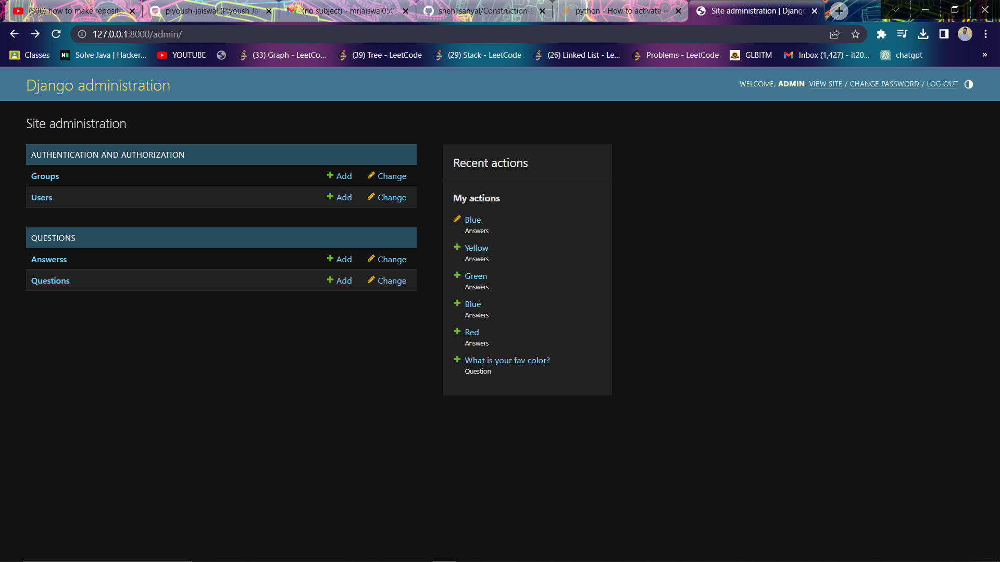
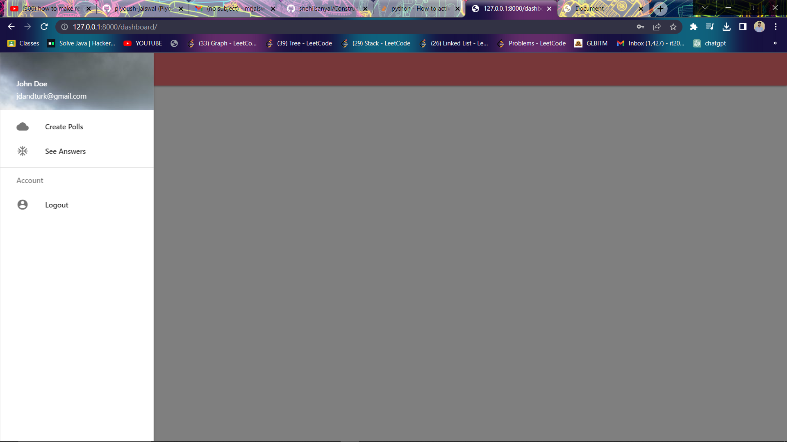
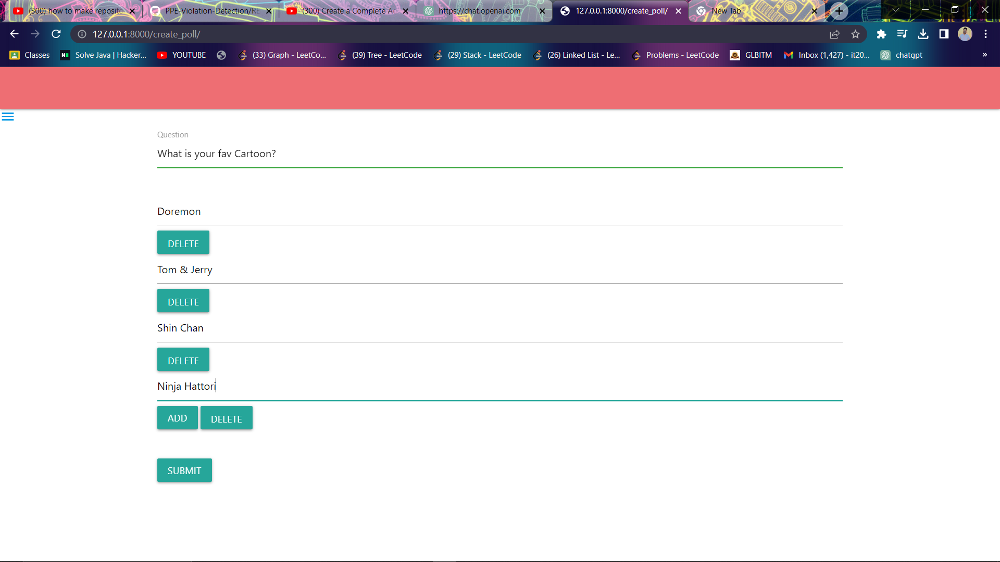
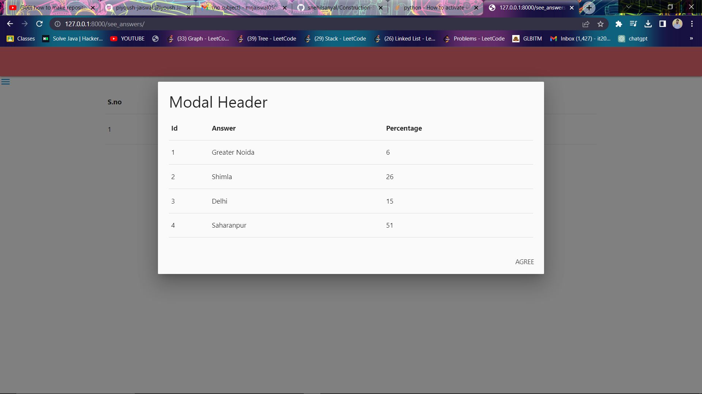
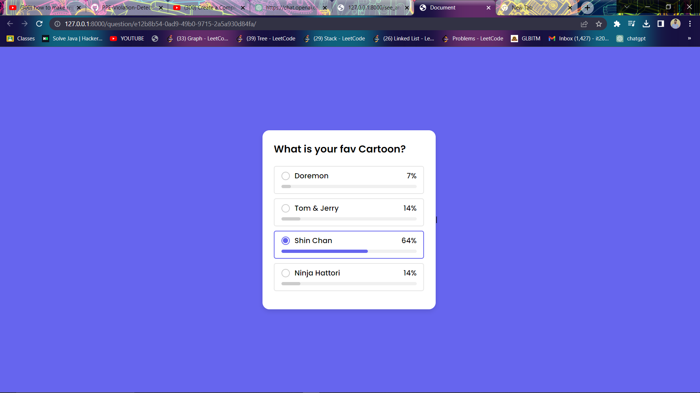
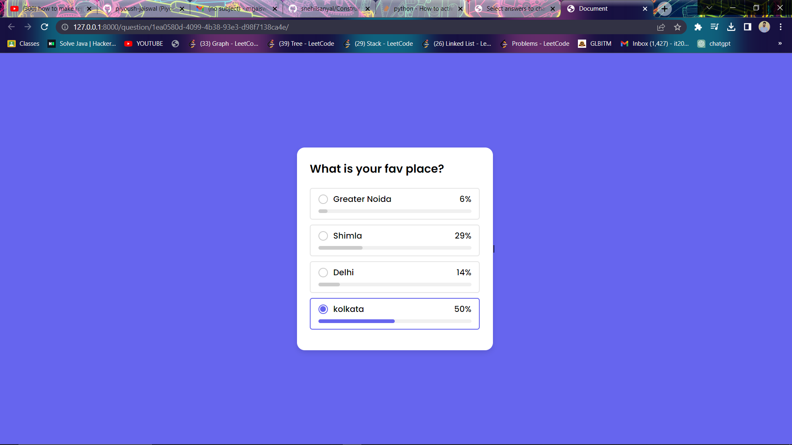

# A Django based Polling Web Application

> A polling-based web application is a platform that allows users to create and participate in polls. Users can create polls on various topics, set options for respondents to choose from, and share the polls with others. Participants can then vote on the options provided and view the poll results in real-time. This interactive and engaging web application enables users to gather opinions, make decisions, and analyze the collected data efficiently. 

## Introduction
Surveys or Interviews, can be time-consuming and resource-intensive. These methods often require significant manual effort to collect, analyze, and interpret data, leading to slower decision-making processes.It typically reach a limited sample of the population, which may not accurately represent the broader target audience, leading to skewed or incomplete results.We create a django based polling application to cover up all the problems discussed.
olling allows for instant feedback and enables organizations to quickly gauge public opinion. 
A polling-based web application is a platform that allows users to create and participate in polls or surveys online. It provides a convenient way for individuals or organizations to gather opinions and feedback from a large audience.

## Setup

Application includes following pages:

Admin Page
Login Page
Register Page for new user
Question Page
See Answer Page
Create Poll Page

## Results

After training, we get the following results:

>Admin Page

> User Dashboard

>Create Poll Page

>See Answer Page

## Outputs

